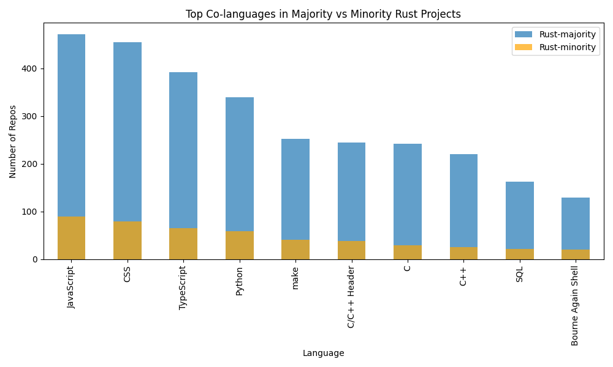

#+TITLE: An Empirical Study of Continuous Integration in Open-Source Rust Projects
#+AUTHOR: Vishravars Ramasubramanian
#+DATE: 2025-07-25
#+OPTIONS: toc:nil num:t
#+CITE_EXPORT: biblatex
#+LATEX_HEADER: \usepackage[backend=biber,style=plain]{biblatex}
#+LATEX_HEADER: \addbibresource{references-rust.bib}
#+LATEX_HEADER: \usepackage{tabularx}
#+LATEX_HEADER: \usepackage[a4paper,margin=2.2cm]{geometry}
* Abstract
<TODO>

* Acknowledgements
<TODO>

* Publications
<TODO>

* Chapter 1: Introduction

** Motivation

Rust has into one of the most talked-about systems programming languages, valued for its strong guarantees of memory safety, speed, and concurrency [cite:@Bugden2022]. With more than 2.3 million developers writing Rust and business adoption up by nearly 70%, major players like Google, Microsoft, and Amazon are increasingly bringing Rust into their stacks [cite:@Schueller2022] [cite:@HBLAB2025]. As a result, Rust is showing up in everything from critical infrastructure to cloud platforms and AI systems.

This rapid rise makes it important to look at how Rust projects keep code quality and reliability in check. Continuous Integration (CI) is the main way teams manage this: every commit triggers off builds, tests, and checks to catch problems earlier in the release cycle. But past studies, like “Continuous Integration Theater,” have shown that many projects fall into bad habits i.e committing too infrequeny, leaving builds broken for long stretches, or letting tests and coverage fall below [cite:@felidre2019ci_theater].

Looking at Rust through this lens can reveal whether similar issues exist in its ecosystem. For example, do projects suffer from long-running broken builds? Are commits spaced too far apart to keep feedback useful? How well are tests and coverage integrated into the pipelines? CI is effective only if it delivers fast and reliable signals to developers, so these questions matter for both productivity and software quality.

By studying a wide set of public Rust repositories on GitHub, this work aims to map out common CI pitfalls, highlight where pipelines fall short, and examine how feedback cycles impact day-to-day development. The aim is to obtain a clear, data-driven picture of Rust CI—what already works, what holds teams back, and where targeted fixes will have payoff.

** Gaps in Rust Continuous Integration (CI) Research

Although Rust is gaining momentum, systematic research into how projects use Continuous Integration (CI) remains limited. Three important gaps can be identified:

- *CI patterns / anti-patterns in Rust are not well documented.*
  Studies in other programming language ecosystems have shown recurring issues such as long-lasting broken builds, infrequent commits, and weak test coverage [cite:@felidre2019ci_theater]. For Rust, no comparable evidence exists, leaving it unclear whether the same challenges occur or whether Rust projects encounter unique ones. Prior work has examined Rust adoption more generally—for example, Fulton et al. (2021) studied the benefits and drawbacks of adopting Rust—but these studies focus on security, tooling, and ecosystem maturity rather than CI workflows [cite:@fulton2021]. Issues such as long compile times and dependency growth are discussed, but CI practices themselves remain unexamined.

- *The effects of CI adoption are not well understood.*
  While CI is often assumed to improve integration frequency and defect detection, few studies have investigated whether Rust projects actually change their development behavior after adopting CI. It remains unclear whether adoption leads to measurable improvements in productivity, build health, or software quality [cite:@felidre2019ci_theater].

- *Polyglot CI setups have received little attention.*
  Many Rust projects combine Rust with other languages—C for bindings, Python for scientific workflows, or JavaScript for web front-ends. This creates pipelines that must integrate Rust’s strict compilation model with more dynamic ecosystems. There is little empirical evidence on how these mixed-language pipelines function in practice, or whether they introduce specific issues such as dependency mismatches, brittle build scripts, or gaps in test coverage. No comparative studies exist to show how CI practices in polyglot Rust projects differ from those in Rust-only projects.

** Research Questions

To address these gaps, this study investigates the following research questions:

- RQ1: What common CI anti-patterns or “CI theater” behaviors are exhibited by Rust projects, and how do these practices affect software quality?

- RQ2: How do Rust projects change in behavior before and after the adoption of CI?

- RQ3: How do CI workflows in polyglot Rust projects differ from those in pure Rust projects, and do polyglot contexts introduce distinctive anti-patterns arising from cross-language integration?

** Purposes, Context and Definitions

** Definitions

For clarity, this study adopts the following definitions:

- *Continuous Integration (CI):* A software engineering practice where developers frequently merge code changes into a shared branch, triggering automated builds and tests. CI aims to detect integration problems early, maintain a releasable codebase, and provide rapid feedback to developers [cite:@Fowler2024].

- *CI Workflow:* The automated pipeline defined in configuration files (e.g., GitHub Actions YAML), specifying jobs such as compilation, testing, linting, code coverage, and deployment checks. In this study, a workflow is considered effective if it provides fast and reliable feedback.

- *Build Duration:* The elapsed time from the start to the completion of a CI run, encompassing compilation, testing, and quality checks. Build duration serves as a proxy for CI feedback latency.

- *Broken Build:* A CI run that results in failure, preventing successful integration of changes. A project is considered to have a *prolonged broken build* if its main branch remains in a failing state for more than two consecutive days [cite:@felidre2019ci_theater].

- *CI Anti-patterns / “CI Theater”:* Practices that give the illusion of continuous integration without delivering its benefits—examples include infrequent commits, prolonged broken builds, and long feedback cycles [cite:@felidre2019ci_theater].

- *Coverage Evidence:* Indicators of whether a project actively measures test coverage as part of CI, either through explicit tools (e.g., tarpaulin) or through reported coverage metrics in CI logs.

- *CI Adoption:* The point in a project’s history when automated builds first appear in a public CI system (e.g., GitHub Actions). Metrics before and after this point are used to study changes in commit frequency, issue handling, and overall workflow health.

- *Bug-like Issues:* Issues labeled or described with terms such as “bug”, “defect”, or “regression”. These are used as a proxy for defect reports when studying project quality before and after CI adoption.

- *Project Size:* Measured as the number of source lines of code (SLOC) in Rust files. Size is used to normalize comparisons across projects and to stratify analysis (e.g., small, medium, large projects) [cite:@Bugden2022].

These definitions establish the conceptual foundation for the empirical analyses conducted in this study.

** Thesis Outline

* Chapter 2: Literature Review

** Literature Review

Continuous Integration (CI) is a widely established practice in which developers frequently merge code into a shared branch, with each integration triggering automated builds and tests to detect issues early [cite:@Fowler2024]. Fowler (2024) emphasizes that effective CI depends on automation, self-testing code, and rapid feedback to keep the codebase consistently releasable. Frequent integrations reduce merge costs, enable earlier bug detection, and sustain quality by encouraging ongoing refactoring and testing [cite:@Fowler2024].

In the Rust ecosystem, these principles are especially significant due to Rust’s long compilation times and its reliance on ecosystem-specific tools such as =cargo test=, Clippy, and coverage frameworks [cite:@Mwendia2024][cite:@HBLAB2025]. Empirical reports highlight approaches such as deterministic builds and version pinning to mitigate toolchain instability, while also noting the difficulty of balancing thorough linting and test coverage against acceptable build times [cite:@Mwendia2024]. For polyglot projects that combine Rust with languages like C++ or Python, additional orchestration and caching strategies are often required [cite:@HBLAB2025].

Despite these advances, several gaps remain. Li et al. (2024) observe that data on Rust CI health metrics beyond build success—such as test coverage consistency, build latency, or feedback cycles—remains limited [cite:@Li2024]. Studies of “CI Theater” have shown that unhealthy practices—prolonged broken builds, infrequent commits, or weak recovery patterns—are widespread in other ecosystems and likely affect Rust projects as well, though they have not yet been studied systematically [cite:@felidre2019ci_theater]. In addition, questions remain about how Rust-specific tools (e.g., Clippy, tarpaulin) integrate with CI/CD platforms and shape workflow adoption [cite:@RustInternals2015].

Empirical understanding of CI in Rust is still emerging [cite:@Bugden2022]. There is a clear need for targeted investigation into Rust projects: to document recurring CI anti-patterns and to assess how practices evolve before and after adoption.

* Chapter 3: Research Design
** Methodology of Research and Analysis
**** Data Curation

To investigate the CI practices of Rust projects, a dataset of open-source repositories hosted on GitHub was curated. The process began with an initial pool of approximately 8,800 repositories, identified through a keyword-based GitHub search restricted to Rust as the primary language (i.e., =lang:Rust=). To ensure active community engagement and a reasonable quality baseline, only repositories with at least 500 GitHub stars were retained. This filtering step produced a working set of 2,256 repositories for analysis.

The selected repositories cover a wide range of domains, including web frameworks, databases, servers, and embedded systems. For the CI Theater analysis, each repository was cloned and source lines of code (SLOC) were measured using the =cloc= (Count Lines of Code) tool. Because many open-source repositories are polyglot in nature, additional filtering was applied to focus the analysis for RQ1 and RQ2 on primarily Rust-based projects. Specifically, the dataset was restricted to repositories where Rust accounted for 100% of total SLOC leaving us 557 projects for study. This threshold excluded polyglot projects whose CI pipelines may be strongly shaped by other ecosystems (e.g., JavaScript or Python). These excluded projects were retained separately for RQ3, which examines how the presence of other languages influences CI workflows.

**** Broken builds

#+begin_export latex
\begin{tabularx}{\linewidth}{@{}XX@{}}
\includegraphics[width=\linewidth]{figures/28_1_broken_stretches_by_size_rust.png} &
\includegraphics[width=\linewidth]{figures/28_1_max_broken_days_by_size_rust.png} \\
\end{tabularx}
#+end_export

The Maximum Broken Build Duration by Project Size chart shows that most projects get back to green quickly. The exceptions are mostly in the small and medium buckets, where a few projects stay broken for a very long time—some for many months. Large projects have far fewer of these very long outages. The “Very Large” group looks too small to draw conclusions.

The Count of Long Broken Build Stretches (>2 Days) chart says that extended outages are not common overall (the typical project has about one). Again, small and medium projects vary the most: some rack up several long episodes. Large projects rarely go beyond one or two.

What this means in practice: the everyday fixes are usually fast, but the rare long breaks cause most of the pain—especially in small and medium repos. Aim to prevent those long red periods: require key checks before merging, keep a quick set of tests that always runs, fix or quarantine flaky tests, lock tool/dependency versions, and if main breaks, restore it quickly (even by reverting) while you work on the real fix.

**** Test coverage

#+begin_export latex
\begin{tabularx}{\linewidth}{@{}XX@{}}
\includegraphics[width=\linewidth]{figures/ci_funnel_counts.png} &
\includegraphics[width=\linewidth]{figures/ci_adoption_breakdown.png} \\
\end{tabularx}
#+end_export

The adoption picture is not even. Half of the repositories have no tests at all (294/557, 52.8%). Among the projects that do have tests (263), nearly all of them run tests in CI (241/263, 91.6%), which is a strong sign that teams value automated checks once tests exist. The main drop occurs at the next stage: only 131 projects surface coverage in CI—about 49.8% of projects with tests, 54.4% of those already running tests in CI, and 23.5% of all projects.

The loss from “has tests” to “tests in CI” is small, but the loss from “tests in CI” to “coverage in CI” is large. Practically, this points to friction around coverage setup and maintenance rather than reluctance to test. The immediate priorities are to (1) raise the share of projects with any tests, and (2) close the coverage gap incrementally—start with change-based coverage or a modest threshold, speed up slow tests so coverage isn’t disabled to save time.

**** Time to First CI and Defects

#+begin_export latex
\begin{tabularx}{\linewidth}{@{}XX@{}}
\includegraphics[width=\linewidth]{figures/25_time_to_first_ci_by_size_rust.png} &
\includegraphics[width=\linewidth]{figures/31_bugs_before_after_ci_rust.png} \\
\end{tabularx}
#+end_export

**** Polyglot study
- Rust Commits vs Other Commits?
- 50% to 99% Rust SOC Study comparing build time, broken builds and test coverage?

** Instruments
The empirical investigation for this thesis was conducted using a custom-developed software toolchain designed to systematically collect, process, and analyze data from a large corpus of open-source Rust repositories. The overall approach follows three primary stages: data curation, metric extraction, and quantitative analysis.

First, a *data curation pipeline* was established to build a high-quality dataset. This involved querying the GitHub API to identify an initial set of active Rust projects, followed by an automated filtering process to exclude repositories that appeared to be demos, tutorials, or boilerplate templates. Each remaining repository was then cloned and its source code was analyzed to determine its language composition. This allowed for the classification of projects into two distinct cohorts: *monoglot* (exclusively Rust) and *polyglot* (Rust combined with other languages), which formed the basis for comparative analysis.

Second, a series of *metric extraction instruments* were deployed to gather empirical data on CI practices for each project. These tools interacted with both the GitHub API and local Git repositories to measure key indicators of CI health. The metrics collected fall into several categories:
- *Workflow Activity:* Commit frequency and recency, and the time from project creation to first CI adoption.
- *Build Health:* Average and maximum build durations, and the frequency and length of prolonged broken build periods.
- *Code Quality Proxies:* Evidence of test execution and code coverage reporting, and the rate of bug-like issues reported before and after CI adoption.

Finally, an *analysis and visualization engine* processed the collected data to answer the research questions. This component generated descriptive statistics, comparative boxplots, and histograms to identify trends and anti-patterns. For comparing project cohorts, such as monoglot versus polyglot projects, non-parametric statistical tests (e.g., Mann-Whitney U) were employed to determine the significance of observed differences. This stage also involved merging metric data with project size information to create stratified analyses (e.g., build duration by project size).

Together, this toolchain provided a reproducible, end-to-end pipeline for transforming raw repository data into the empirical findings presented in this study.

** Procedure and Timeline
The research was conducted in four distinct phases:

1.  *Dataset Curation:* An initial list of popular Rust repositories was compiled from GitHub. This list was programmatically filtered to remove inactive or non-representative projects, such as demos and tutorials. The remaining repositories were then cloned and their source code was analyzed to determine their language composition, which allowed for their classification into *monoglot* (pure Rust) and *polyglot* (mixed-language) cohorts.

2.  *Metric Extraction:* A suite of custom Python scripts was executed on both project cohorts. These scripts interacted with the GitHub API and local Git repositories to collect data on key CI health indicators, including commit frequency, build duration, broken build stretches, test coverage signals, and bug-like issue counts. This phase was the most time-intensive due to API rate limits and the computational cost of cloning and analyzing hundreds of repositories.

3.  *Quantitative Analysis:* The raw data from the extraction phase was processed to generate descriptive statistics, comparative boxplots, and histograms. Non-parametric statistical tests (Mann-Whitney U) were used to compare the monoglot and polyglot cohorts and determine the statistical significance of any observed differences. This stage also involved stratifying the data by project size to identify how scale influences CI practices.

4.  *Interpretation and Reporting:* The final phase involved interpreting the statistical results and visualizations to answer the research questions. Findings were synthesized, and the key trends, anti-patterns, and implications were documented in this thesis.

The study was executed over a 20-week period, structured as follows:

- *Weeks 1–2: Literature Review and Tooling Setup*
  - Conducted a review of existing literature on CI/CD practices.
  - Developed and tested the initial data collection and filtering scripts.

- *Weeks 3–6: Data Curation and Cohort Definition*
  - Identified and filtered the initial set of Rust repositories.
  - Cloned repositories and performed language composition analysis to define monoglot and polyglot cohorts.

- *Weeks 7–12: Metric Extraction*
  - Executed the full suite of data collection scripts against both project cohorts.
  - Managed API rate limits and handled errors from unresponsive or missing repositories.

- *Weeks 13–16: Data Analysis and Visualization*
  - Processed the collected data to generate summary statistics.
  - Created comparative plots and ran statistical tests.
  - Interpreted the results to identify key findings for each research question.

- *Weeks 17–20: Thesis Writing and Review*
  - Drafted the main chapters of the thesis.
  - Incorporated figures and tables.
  - Conducted review and revision cycles.
** Data Analyses
** Ethics
** Limitations

* Chapter 4: Results
** 4.1 Research Question 1
** 4.2 Research Question 2
* Chapter 5: Discussion
** 5.1 Overview
** 5.2 Interpretation
** 5.3 Strengths and Limitations

* Chapter 6: Conclusions
** 6.1 Summary
** 6.2 Original Contributions
** 6.3 Recommendations
** 6.4 Future Work

* Chapter 7: References
#+LATEX: \printbibliography[heading=none]
* Appendices
** Appendix A: Ethics Approval
