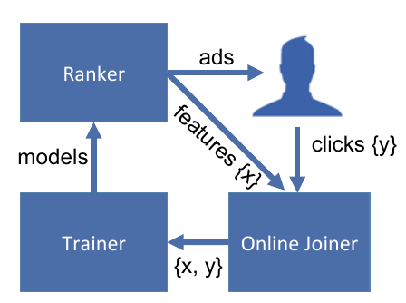
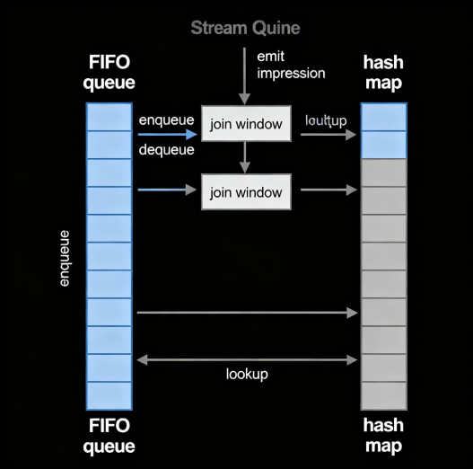
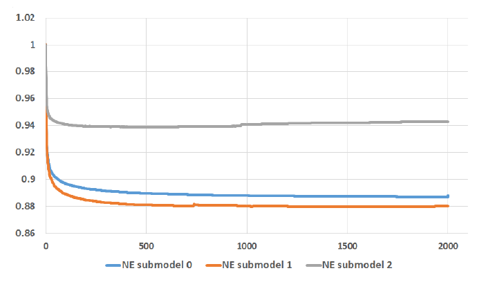
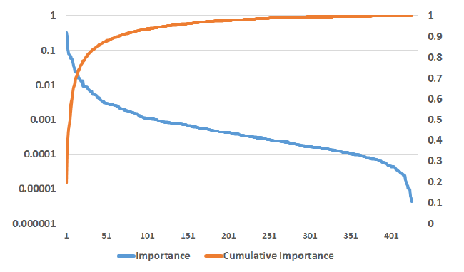
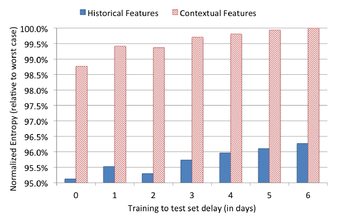

# INFO411 Online Data Joiner
## Practical Lessons from Predicting Clicks on Ads at Facebook

---

## Online Data Joiner – Data Flow

**Task**: Stream real-time training data

❓How to join *freshness* vs. *click impressions*❓

Similar infrastructure used by **google advertisements !**

<a href="#memory-trees" style="font-size: 2rem; text-decoration: none;">⬇️ Next</a>

---

## Online Data Joiner

**Per-coordinate learning rate**:

$$
\eta_{t,i} = \frac{\alpha}{\beta + \sqrt{\sum_{j=1}^t g_{j,i}^2}} 
$$

- Train **Online Logistic Regression** with **SGD**
- Marginally better than **BOPR**
- ❓Challenges in Online Data Joining❓

---

## Online Data Joiner - Challenges & Solution

**Anomaly detection** - Trainer <-x-> Joiner

**HashQueue** & **Request ID** for efficient stream-to-stream joining.

---

## Memory & Latency - Boosted tree

- More tree in model = more time for prediction
- Train **1 full day**
- Vary number of trees from **1 to 2000**
- Test/Prediction on **next day**
- Restrict leaves to **12 leaves/tree**
- Use **Normalized Entrophy** as evaluation metric

---

## Memory & Latency – Boosted tree

- Prediction accuracy improves with more boosted trees, mostly within the **first 500 trees**.

- Beyond **500 trees**, gains diminish (NE change < 0.1>)

- **Overfitting** ? Due to smaller training data in **submodel 2** compared to others.

---

## Memory & Latency – Feature Importance

- **Feature count** affects **estimation accuracy** and **computation performance**
- *Boosting Feature Importance* 
    - **Sum of error reductions** made by feature across all **tree splits**
- ❓Whats the finding of the Boosting Feature Importance❓

<a href="#historical-context" style="font-size: 2rem; text-decoration: none;">⬇️ Next</a>

---

## Memory & Latency – Feature Importance

**Findings**:
Top **10 features ≈ 50%** of total feature importance  
Small subset of features accounts for most predictive power  
**Question**: ❓Which features are most critical❓

<a href="#historical-context" style="font-size: 2rem; text-decoration: none;">⬇️ Next</a>

---

## Historical vs. Contextual Features

- **Findings**: **Historical >> Contextual** in accuracy   
- **Question**: How to best **combine history + context**?
Note: Contextual features essential for **cold start** scenarios

<a href="#massive-approach" style="font-size: 2rem; text-decoration: none;">⬇️ Next</a>

---