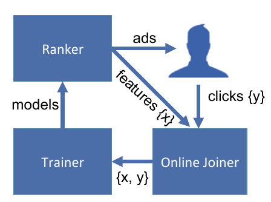

# INFO411 Online Data Joiner
## Practical Lessons from Predicting Clicks on Ads at Facebook

---

## Online Data Joiner – Task & Approach

- **Task**: Stream real-time training data  
- **Approach**: Join **clicks ↔ impressions**, handle **no-click labels** carefully  
- Train **online LR with SGD**  

<a href="#question-1" style="font-size: 2rem; text-decoration: none;">⬇️ Next</a>

---

## Online Data Joiner – Learning Rate Formula

- **Per-coordinate learning rate**:

$$
\eta_{t,i} = \frac{\alpha}{\beta + \sqrt{\sum_{j=1}^t g_{j,i}^2}}
$$

<a href="#question-1" style="font-size: 2rem; text-decoration: none;">⬇️ Next</a>

---

## Online Data Joiner – Data Flow

**Question**: How to trade off *freshness* vs. *click coverage*❓

  
*Closed-loop: real-time impressions and clicks feed into training*

<a href="#memory-trees" style="font-size: 2rem; text-decoration: none;">⬇️ Next</a>

---

---

## Memory & Latency – Feature Importance

- **Findings**:
  - Top **10 features ≈ 50%** of cumulative importance  
  - Small subset of features accounts for most predictive power  
  - **Question**: How many features can we remove without significantly hurting performance?

<a href="#historical-context" style="font-size: 2rem; text-decoration: none;">⬇️ Next</a>

---

---

## Memory & Latency – Feature Importance

- **Findings**:  
  - Top **10 features ≈ 50%** of cumulative importance  
- **Question**: Which features are most critical

<a href="#historical-context" style="font-size: 2rem; text-decoration: none;">⬇️ Next</a>

---

## Historical vs. Contextual Features

- **Task**: Compare feature types  
- **Findings**:  
  - **Historical >> Contextual** in accuracy  
  - Contextual features essential for **cold start** scenarios  
- **Question**: How to best **combine history + context**?

<a href="#massive-approach" style="font-size: 2rem; text-decoration: none;">⬇️ Next</a>

---

## Massive Training Data – Approach

- **Task**: Control training cost  
- **Approach**:  
  - **Uniform subsampling**  
  - **Negative down sampling** to address **class imbalance** (+ re-calibration)  

$$
q = \frac{p}{p + (1-p)/w}
$$

<a href="#massive-findings" style="font-size: 2rem; text-decoration: none;">⬇️ Next</a>

---

## Massive Training Data – Findings

- More data → better performance, **diminishing returns**  
- Using 10% of data → ~1% NE reduction  

❓ **Question**: How much can we *sample* without hurting accuracy?  

<a href="#key-takeaways" style="font-size: 2rem; text-decoration: none;">⬇️ Next</a>

---

## Key Takeaways

- **Data freshness matters**: online joiner ensures real-time updates  
- **Hybrid model works best**: LR + SGD with per-coordinate learning rates  
- **Boosting efficiency**: limit number of trees/features to avoid overfitting  
- **Feature types**: historical features dominate, but contextual features help cold start  
- **Data scale**: more training data helps, but diminishing returns apply; negative down sampling can handle class imbalance  

