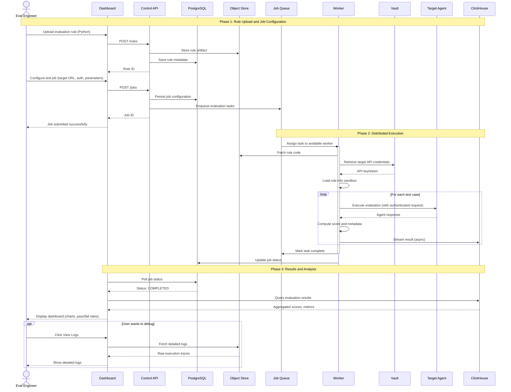
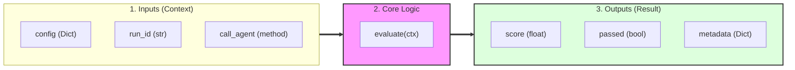
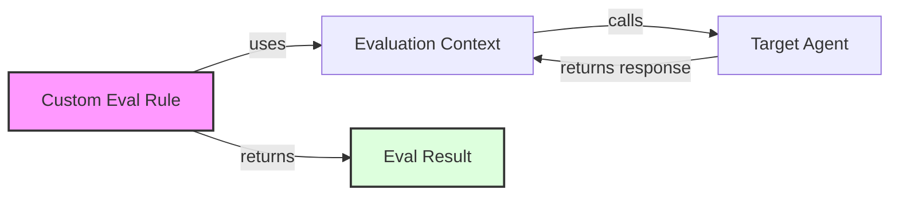

# Scalable Agentic Evaluation System - Solution Architecture

## 1. Executive Summary
This document outlines the solution architecture for a scalable system designed to evaluate Agentic API endpoints. The system is designed to be **deployment-agnostic**, running equally well on public cloud (AWS/GCP/Azure) or on-premise infrastructure (Private Cloud/Bare Metal). It features a pluggable rule interface, scalable execution engine, and comprehensive analytics dashboard.

## 2. User Personas

To clarify system usage and access control, we define the following high-level roles:

| Role | Description | Responsibilities |
| :--- | :--- | :--- |
| **Platform Admin** | Infrastructure & System Owner | Manage K8s clusters, DBs, user access, and global quotas. Ensures system uptime. |
| **Eval Engineer** | Primary User / Developer | Writes Python eval rules, configures test jobs, debugs failures, and uses the SDK. |
| **Product Stakeholder** | Viewer / Analyst | Views dashboards, checks pass rates, and analyzes aggregated reports. Read-only access. |

## 3. High-Level Architecture

The system is divided into three main planes:
1.  **Control Plane**: Manages users, test configurations, and displays results.
2.  **Execution Plane**: Orchestrates and executes the evaluation rules against target agents.
3.  **Data Plane**: Stores test results, rule definitions, and execution logs.

### System Diagram (Mermaid)


### System Diagram v2 (Enhanced)

```mermaid
graph TD
    User["👤 Eval Engineer"] -->|1. Upload Rule| Dashboard
    User -->|2. Configure Job| Dashboard
    
    subgraph control["🎛️ Control Plane"]
        Dashboard["Dashboard UI"]
        API["REST API"]
        DB[("PostgreSQL")]
        ObjectStore[("S3/MinIO")]
        
        Dashboard --> API
        API --> DB
        API --> ObjectStore
    end
    
    subgraph execution["⚙️ Execution Plane"]
        Queue["Job Queue"]
        Orchestrator["Orchestrator"]
        Workers["Worker Pool"]
        
        API -->|3. Submit Job| Queue
        Queue --> Orchestrator
        Orchestrator -->|4. Distribute Tasks| Workers
        
        subgraph worker_node["Worker Pod"]
            Runtime["Python Runtime"]
            Sandbox["Rule Sandbox"]
            Runtime --> Sandbox
        end
        
        Workers --> worker_node
        Sandbox -->|5. Invoke| Agent["🤖 Target Agentic API"]
        Agent --> Sandbox
    end
    
    subgraph data_plane["💾 Data Plane"]
        Stream["Stream Processor"]
        Analytics[("ClickHouse/BigQuery")]
        Logs[("S3/MinIO Logs")]
        
        worker_node -->|6. Stream Results| Stream
        Stream --> Analytics
        Stream --> Logs
    end
    
    Dashboard -.->|7. Query Results| Analytics
    Dashboard -.-> Logs
    
    subgraph security["🔒 Security Layer"]
        Vault["HashiCorp Vault"]
        Auth["OIDC/Auth"]
    end
    
    API -.-> Vault
    Dashboard -.-> Auth
    Sandbox -.-> Vault
    
    style control fill:#e1f5ff,stroke:#0277bd,stroke-width:2px
    style execution fill:#fff4e1,stroke:#f57c00,stroke-width:2px
    style data_plane fill:#e8f5e9,stroke:#388e3c,stroke-width:2px
    style security fill:#fce4ec,stroke:#c2185b,stroke-width:2px
    style Agent fill:#fff3e0,stroke:#e65100,stroke-width:3px
```



### Evaluation Flow Sequence Diagram



## 3. Pluggable Interface Design (The "SDK")

To enable flexible and powerful evaluation rules, we define a standard Python SDK that developers use.

### Base Class Definition
Evaluators implement a standard interface. This allows the system to load and execute them blindly.

```python
from abc import ABC, abstractmethod
from typing import Dict, Any

class EvaluationContext:
    """Provides context like unique run_id, logger, and client for target agent."""
    run_id: str
    target_url: str
    config: Dict[str, Any]

    def call_agent(self, prompt: str) -> str:
        """Helper to safely call the target agent API."""
        pass

class BaseEvalRule(ABC):
    """The contract for all evaluation rules."""
    
    @property
    @abstractmethod
    def name(self) -> str:
        """Unique name of the evaluation rule."""
        pass

    @abstractmethod
    def evaluate(self, ctx: EvaluationContext) -> Dict[str, Any]:
        """
        Execute the evaluation logic.
        Returns: Dict containing 'score', 'passed' (bool), and 'metadata'.
        """
        pass
```

### Anatomy of an Evaluation Rule

The following diagram depicts the necessary elements that constitute a custom evaluation rule:



**Rule Anatomy Elements:**

| Section | Element | Type | Description |
| :--- | :--- | :--- | :--- |
| **1. Inputs** | `config` | `Dict` | Configuration parameters for the specific evaluation rule (e.g., thresholds, prompts). |
| | `run_id` | `str` | A unique identifier for the current evaluation run, used for logging and correlation. |
| | `call_agent` | `method` | A helper method to securely invoke the target agentic API. |
| **2. Logic** | `evaluate(ctx)` | `method` | The core function where the developer implements the evaluation logic using the context provided. |
| **3. Outputs** | `score` | `float` | A numerical score (typically 0-100) representing the quality of the agent's response. |
| | `passed` | `bool` | A binary status indicating whether the agent met the evaluation criteria. |
| | `metadata` | `Dict` | Rich contextual data for analytics, debugging, and dashboard visualization. |

### Conceptual Model

This diagram shows how the core objects integrate during a single evaluation run.



**Core Terms:**

| Term | Role | Responsibility |
| :--- | :--- | :--- |
| **Custom Eval Rule** | Logic | Developer-defined code that implements the evaluation logic. |
| **Evaluation Context** | Bridge | Provides the rule with configuration and a secure way to call the agent. |
| **Target Agent** | Subject | The external system or API being evaluated. |
| **Eval Result** | Output | The standardized output containing the `score` and `passed` status. |

### 3.2. Target Authentication
The system supports multiple authentication standards to connect to the target Agentic APIs. Credentials are strictly separated from rule code.

**Supported Schemes:**
1.  **API Key**: Injected as a custom header (e.g., `x-api-key`, `Authorization`) or query parameter.
2.  **Bearer Token**: Standard OAuth2/JWT tokens (`Authorization: Bearer <token>`).
3.  **Basic Auth**: Standard username/password scheme.
4.  **mTLS**: Client certificates for highly secure internal environments.

**Mechanism:**
- **Configuration**: Admins configure "Secrets" per Project/Target in the Dashboard.
- **Injection**: The `EvaluationContext` is hydrated with an authenticated HTTP client, or secrets are injected as environment variables (`TARGET_API_KEY`) into the sandbox for the rule to use explicitly.
- **Security**: Secrets are stored in HashiCorp Vault or K8s Secrets, never in plain text in the DB.

### 3.3. Rule Authoring & Editing
- **Code-First**: Developers use the SDK to write rules in their IDE and push to git/storage.
- **Dashboard Editor**: authenticated users with `EDITOR` or `ADMIN` roles can edit rule code directly in the Dashboard.
    - *Mechanism*: The Dashboard fetches the rule content from the API, user edits in Monaco Editor (VS Code web), and saves. The API versions the rule and updates the Object Store.
    - *Security*: Strict RBAC checks ensure only authorized personnel can modify production rules.

## 4. Component Details

### 4.1. Orchestrator & Scaling
- **Choice**: Kubernetes + Celery/Redis OR Temporal.io.
- **Reasoning**: Temporal provides excellent handling of long-running evaluations (conversations) and reliable retries. Kubernetes HPA (Horizontal Pod Autoscaler) scales the Worker Pool based on queue depth.

### 4.2. Storage Strategy
- **Primary DB (Postgres)**: Stores Users, Projects, Rule Metadata, Job Configurations. Portable and standard.
- **Analytics DB (ClickHouse)**: Stores the raw evaluation results.
    - *Cloud Mode*: Managed ClickHouse or BigQuery.
    - *On-Prem Mode*: Self-hosted ClickHouse or TimescaleDB.
- **Object Storage**: Stores the actual rule code artifacts and full raw logs/traces.
    - *Cloud Mode*: AWS S3, GCS, Azure Blob.
    - *On-Prem Mode*: **MinIO** or Ceph (S3-compatible API).

### 4.3. Dashboard
- **Tech**: React/Next.js + Recharts/D3.
- **Features**:
    - **Rule Editor**: Full Monaco-based code editor with syntax highlighting for on-the-fly rule modifications (guarded by RBAC).
    - **Job Monitor**: Real-time progress of running evals.
    - **Analytics**: Charts showing pass rates, latency distributions, and cost tracking.

## 5. Deployment & Security
- **Deployment Environments**:
    - **Cloud**: Managed Kubernetes (EKS/GKE), DBaaS (RDS, Big Query).
    - **On-Premise**:
        - Orchestration: Self-managed Kubernetes (Rancher, OpenShift) or pure Docker Swarm for smaller setups.
        - Storage: MinIO (Object Store), PostgreSQL (Meta), ClickHouse (Analytics) deployed as StatefulSets or external clusters.
- **Isolation**:
    - Evaluation code runs in isolated containers.
    - *Security*: Use **gVisor** or **Kata Containers** runtime classes in K8s for hard isolation on-premise where users might not control the hypervisor.
- **Auth**:
    - OIDC/OAuth2 integration (Keycloak for on-prem, Auth0/Cognito for cloud) for User Management.
    - Vault (HashiCorp) for secret management in both environments.

## 6. Implementation Steps
1.  **Define SDK**: Publish `agent-eval-sdk` pypi package.
2.  **Build Worker**: Create the container capable of dynamic loading.
3.  **Setup Infra**: Deploy K8s cluster and Databases.
4.  **Dev API**: Build the control plane API.
