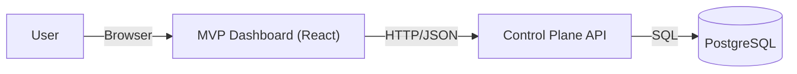
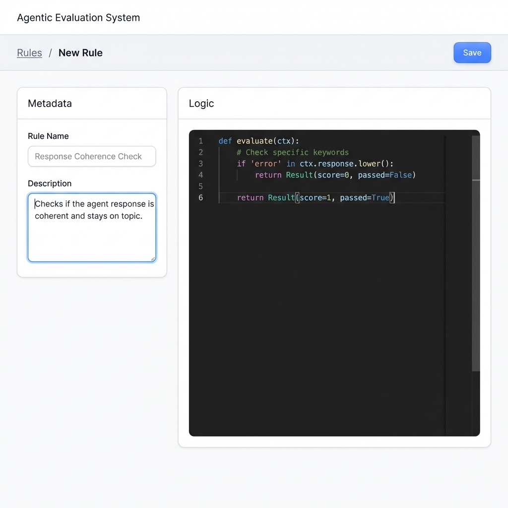
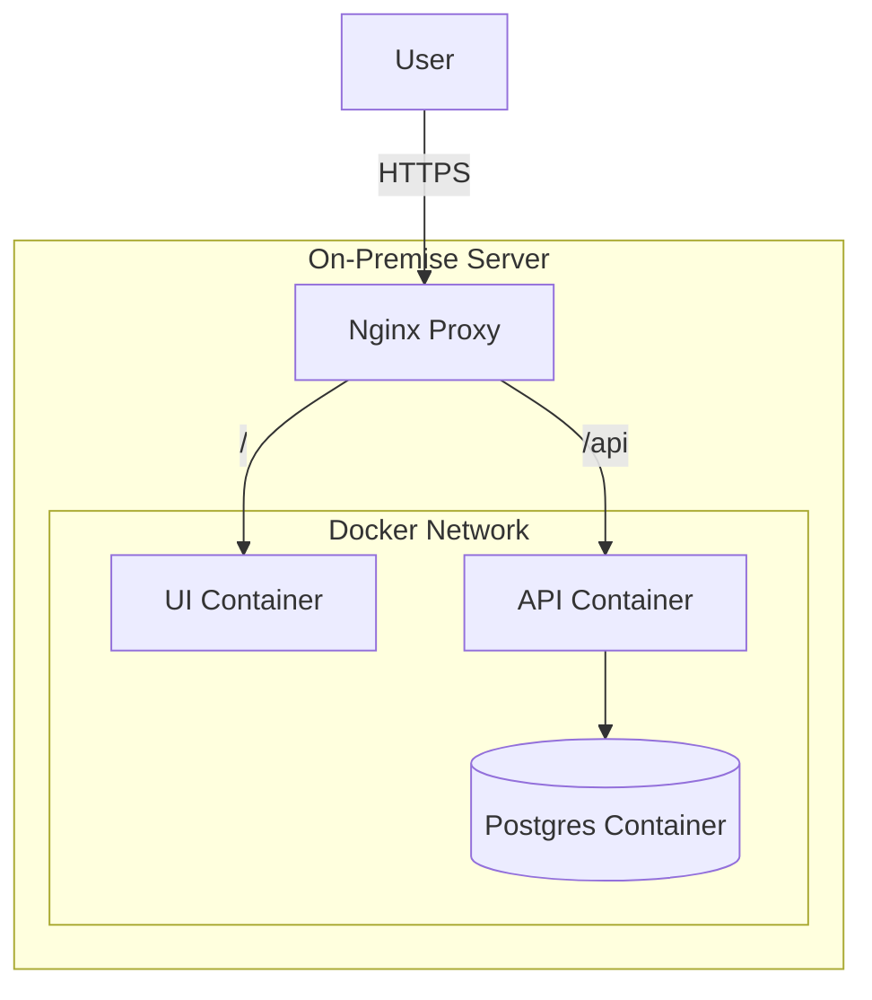

# MVP: Minimal Agentic Evaluation System

## 1. Goal and Scope
The goal of this MVP is to establish the fundamental capability to manage evaluation rules. This corresponds to the **Control Plane** of the larger architecture, specifically focusing on the "Rule Authoring" aspect.

**In Scope:**
*   **Evaluation Rules**: Defining and managing rules (Python-based).
*   **Agent Registry**: Registering and managing target agents (SUT).
*   **Job Management**: associating Rules with Agents to create evaluation runs.
*   **CRUD API**: REST API for Rules, Agents, and Jobs.
*   **Management UI**: A web interface for users to manage their library of rules and agents.
*   **Persistence**: Storing all data in a reliable PostgreSQL database.

**Out of Scope (for MVP):**
*   Execution Engine (Running the rules actual logic - partially in scope via manual "Run Eval" trigger for binding).
*   Orchestrators / Workers / Queues (Future).
*   Results Analytics / Dashboarding.

## 2. Architecture

The MVP simplifies the architecture to a traditional 3-tier web application:



### 2.1. Component Descriptions
*   **Frontend (UI)**: React-based SPA with tabs for Rules, Agents, and Jobs.
*   **Backend (API)**: FastAPI handling CRUD operations.
*   **Database**: PostgreSQL to store rule definitions, agent configs, and job links.

## 3. Data Model

### 3.1. Evaluation Rules
```sql
CREATE TABLE evaluation_rules (
    id UUID PRIMARY KEY DEFAULT gen_random_uuid(),
    name VARCHAR(255) NOT NULL UNIQUE,
    description TEXT,
    code_content TEXT NOT NULL,
    rule_type VARCHAR(50) DEFAULT 'PYTHON', -- Retained for future
    created_at TIMESTAMP WITH TIME ZONE DEFAULT CURRENT_TIMESTAMP,
    updated_at TIMESTAMP WITH TIME ZONE DEFAULT CURRENT_TIMESTAMP
);
```

### 3.2. Agents
```sql
CREATE TABLE agents (
    id UUID PRIMARY KEY DEFAULT gen_random_uuid(),
    name VARCHAR(255) NOT NULL UNIQUE,
    url VARCHAR(255) NOT NULL,
    auth_config JSONB DEFAULT '{}',
    created_at TIMESTAMP WITH TIME ZONE DEFAULT CURRENT_TIMESTAMP,
    updated_at TIMESTAMP WITH TIME ZONE DEFAULT CURRENT_TIMESTAMP
);
```

### 3.3. Jobs
```sql
CREATE TABLE jobs (
    id UUID PRIMARY KEY DEFAULT gen_random_uuid(),
    rule_id UUID REFERENCES evaluation_rules(id),
    agent_id UUID REFERENCES agents(id),
    status VARCHAR(50) DEFAULT 'PENDING',
    created_at TIMESTAMP WITH TIME ZONE DEFAULT CURRENT_TIMESTAMP
);
```

*   `code_content`: Stored directly in DB.
*   `auth_config`: JSONB field to store auth headers/tokens for the agent.

## 4. API Specification

| Method | Endpoint | Description | Payload / Params |
| :--- | :--- | :--- | :--- |
| **GET** | `/api/rules` | List all rules | `?limit=50&offset=0` |
| **GET** | `/api/rules/{id}` | Get single rule details | - |
| **POST** | `/api/rules` | Create a new rule | `{ "name": "...", "code_content": "..." }` |
| **PUT** | `/api/rules/{id}` | Update existing rule | `{ "name": "...", "code_content": "..." }` |
| **DELETE** | `/api/rules/{id}` | Delete a rule | - |

## 5. UI User Flow

### 5.1. View All Rules (Home)
*   Displays a table of existing rules.
*   Columns: Name, Last Updated, Actions (Edit, Delete).
*   "Create New Rule" button at the top.

### 5.2. Create / Edit Rule
*   Form with:
    *   **Name**: Text input.
    *   **Description**: Text area.
    *   **Rule Logic**: Code editor (Monaco or simple text area) for the Python code.
*   **Save**: Submits to `POST /api/rules` or `PUT /api/rules/{id}`.
*   **Cancel**: Returns to list.

### 5.3. Visual Mockup




## 6. On-Premise Deployment

For on-premise environments where public cloud services are not available, the MVP can be deployed using standard open-source technologies.

### 6.1. Infrastructure Stack

| Category | Component | Technology Choice |
| :--- | :--- | :--- |
| **Orchestration** | **Docker Compose** | Recommended for simple, single-node MVP deployments. Easy to set up and manage. |
| | **Kubernetes** | For larger, scaled deployments. Compatible with any standard K8s distribution (Rancher, OpenShift, Vanilla). |
| **Database** | **PostgreSQL** | Deployed as a stateful container (e.g., `postgres:15-alpine`) with a persistent volume mount for data durability. |
| **Networking** | **Nginx** | Acts as a reverse proxy and ingress controller to route traffic to the UI and API containers. Handles SSL verification. |

### 6.2. Deployment Diagram (Docker Compose)


