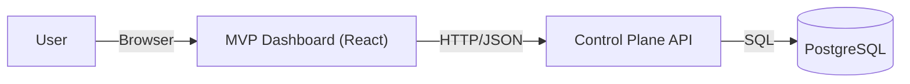
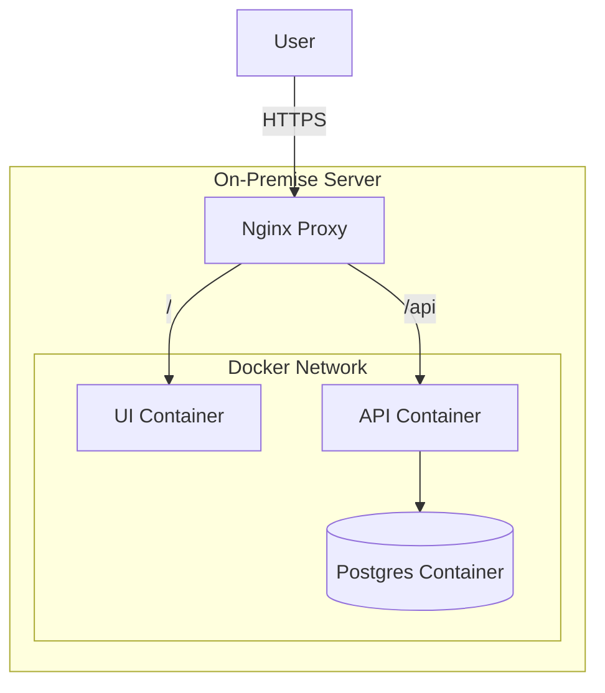

# MVP: Minimal Agentic Evaluation System

## 1. Goal and Scope
The goal of this MVP is to establish the fundamental capability to manage evaluation rules. This corresponds to the **Control Plane** of the larger architecture, specifically focusing on the "Rule Authoring" aspect.

**In Scope:**
*   **Evaluation Rules**: Defining and managing rules (Python-based).
*   **Agent Registry**: Registering and managing target agents (SUT).
*   **Job Management**: associating Rules with Agents to create evaluation runs.
*   **Execution Engine**: Synchronous and asynchronous execution of Python-based evaluation rules.
*   **Evaluation Results**: Storing and retrieving detailed execution outputs and errors.
*   **CRUD API**: REST API for Rules, Agents, Jobs, and Results.
*   **Management UI**: A web interface for users to manage their library of rules and agents.
*   **Persistence**: Storing all data in a reliable PostgreSQL database.

**Out of Scope (for MVP):**
*   Orchestrators / Workers / Queues (Future scaling).
*   Advanced Results Analytics / Dashboarding.

## 2. Architecture

The MVP simplifies the architecture to a traditional 3-tier web application:



### 2.1. Component Descriptions
*   **Frontend (UI)**: React-based SPA with tabs for Rules, Agents, and Jobs.
*   **Backend (API)**: FastAPI handling CRUD operations.
*   **Database**: PostgreSQL to store rule definitions, agent configs, and job links.

## 3. Data Model

### 3.1. Evaluation Rules
```sql
CREATE TABLE evaluation_rules (
    id UUID PRIMARY KEY DEFAULT gen_random_uuid(),
    name VARCHAR(255) NOT NULL UNIQUE,
    description TEXT,
    code_content TEXT NOT NULL,
    rule_type VARCHAR(50) DEFAULT 'PYTHON', -- Retained for future
    created_at TIMESTAMP WITH TIME ZONE DEFAULT CURRENT_TIMESTAMP,
    updated_at TIMESTAMP WITH TIME ZONE DEFAULT CURRENT_TIMESTAMP
);
```

### 3.2. Agents
```sql
CREATE TABLE agents (
    id UUID PRIMARY KEY DEFAULT gen_random_uuid(),
    name VARCHAR(255) NOT NULL UNIQUE,
    url VARCHAR(255) NOT NULL,
    auth_config JSONB DEFAULT '{}',
    created_at TIMESTAMP WITH TIME ZONE DEFAULT CURRENT_TIMESTAMP,
    updated_at TIMESTAMP WITH TIME ZONE DEFAULT CURRENT_TIMESTAMP
);
```

### 3.3. Jobs
```sql
CREATE TABLE jobs (
    id UUID PRIMARY KEY DEFAULT gen_random_uuid(),
    rule_id UUID REFERENCES evaluation_rules(id),
    agent_id UUID REFERENCES agents(id),
    status VARCHAR(50) DEFAULT 'PENDING',
    config_overrides JSONB DEFAULT '{}',
    created_at TIMESTAMP WITH TIME ZONE DEFAULT CURRENT_TIMESTAMP
);
```

### 3.4. Eval Results
```sql
CREATE TABLE eval_results (
    id UUID PRIMARY KEY DEFAULT gen_random_uuid(),
    job_id UUID REFERENCES jobs(id) NOT NULL,
    status VARCHAR(50) NOT NULL, -- SUCCESS, FAILED
    output JSONB DEFAULT '{}',
    error TEXT,
    started_at TIMESTAMP WITH TIME ZONE NOT NULL,
    completed_at TIMESTAMP WITH TIME ZONE NOT NULL
);
```

*   `code_content`: Stored directly in DB.
*   `auth_config`: JSONB field to store auth headers/tokens for the agent.
*   `config_overrides`: JSONB field for job-specific parameters passed to the rule.

## 4. API Specification

| Method | Endpoint | Description | Payload / Params |
| :--- | :--- | :--- | :--- |
| **GET** | `/api/rules` | List all rules | - |
| **GET** | `/api/rules/{id}` | Get single rule | - |
| **POST** | `/api/rules` | Create rule | `{ "name": "...", "code_content": "...", "rule_type": "PYTHON" }` |
| **PUT** | `/api/rules/{id}` | Update rule | - |
| **DELETE** | `/api/rules/{id}` | Delete rule | - |
| **GET** | `/api/agents` | List agents | - |
| **POST** | `/api/agents` | Register agent | `{ "name": "...", "url": "...", "auth_config": {} }` |
| **GET** | `/api/jobs` | List jobs | - |
| **POST** | `/api/jobs` | Create job & Trigger Execution | `{ "rule_id": "...", "agent_id": "...", "config_overrides": {} }` |
| **POST** | `/api/jobs/{id}/execute` | Manually/Sync Execute Job | - |
| **GET** | `/api/jobs/{id}/result` | Get Evaluation Result | - |

## 5. UI User Flow

### 5.1. Navigation
*   **Tabs**: Rules, Agents, Jobs.

### 5.2. Rules Tab
*   List existing rules.
*   Editor: Create/Edit Python rules (Monaco Editor).
*   **Run Eval**: Button to trigger a job creation for the selected rule.

### 5.3. Agents Tab
*   **Registry**: List registered agents (Name, URL).
*   **Register Agent**: Form to add a new target system to evaluate.

### 5.4. Jobs Tab
*   **Monitor**: List of created evaluation jobs with their status (PENDING/COMPLETED) and links to the Rule and Agent.

### 5.5. Visual Mockup


## 6. On-Premise Deployment

For on-premise environments where public cloud services are not available, the MVP can be deployed using standard open-source technologies.

### 6.1. Infrastructure Stack

| Category | Component | Technology Choice |
| :--- | :--- | :--- |
| **Orchestration** | **Docker Compose** | Recommended for simple, single-node MVP deployments. Easy to set up and manage. |
| | **Kubernetes** | For larger, scaled deployments. Compatible with any standard K8s distribution (Rancher, OpenShift, Vanilla). |
| **Database** | **PostgreSQL** | Deployed as a stateful container (e.g., `postgres:15-alpine`) with a persistent volume mount for data durability. |
| **Networking** | **Nginx** | Acts as a reverse proxy and ingress controller to route traffic to the UI and API containers. Handles SSL verification. |

### 6.2. Deployment Diagram (Docker Compose)



## 7. Rule Evaluation

The system supports writing complex evaluation logic in Python. These rules are executed in a controlled environment with access to essential utilities.

### 7.1. Rule Signature

Every rule must define an `evaluate` function. It can be either synchronous or asynchronous.

```python
async def evaluate(agent_url, auth_config, config):
    # logic here
    return { "passed": True, "score": 1.0 }
```

### 7.2. Available Context

The following are injected into the rule's execution context:

*   **Variables**:
    *   `agent_url`: The base URL of the agent under test.
    *   `auth_config`: The authentication dictionary (e.g., headers).
    *   `config`: Merged configuration overrides from the Job definition.
*   **Helpers**:
    *   `call_agent(url, payload, auth, method)`: A helper for making HTTP requests to the agent.
*   **Libraries**:
    *   `httpx`: For custom async HTTP requests.
    *   `json`: For data manipulation.

### 7.3. Execution Flow

1.  **Trigger**: Job is created via API.
2.  **Context Preparation**: Backend fetches Agent and Rule data, merges configs.
3.  **Dynamic Loading**: The `code_content` is executed using Python's `exec()`.
4.  **Invocation**: The `evaluate` function is called (awaited if async).
5.  **Persistence**: Results are captured and stored in the `eval_results` table.
